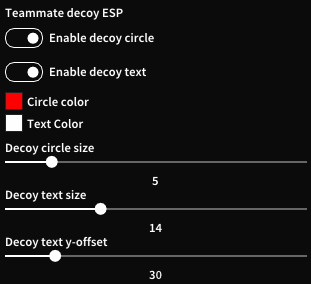
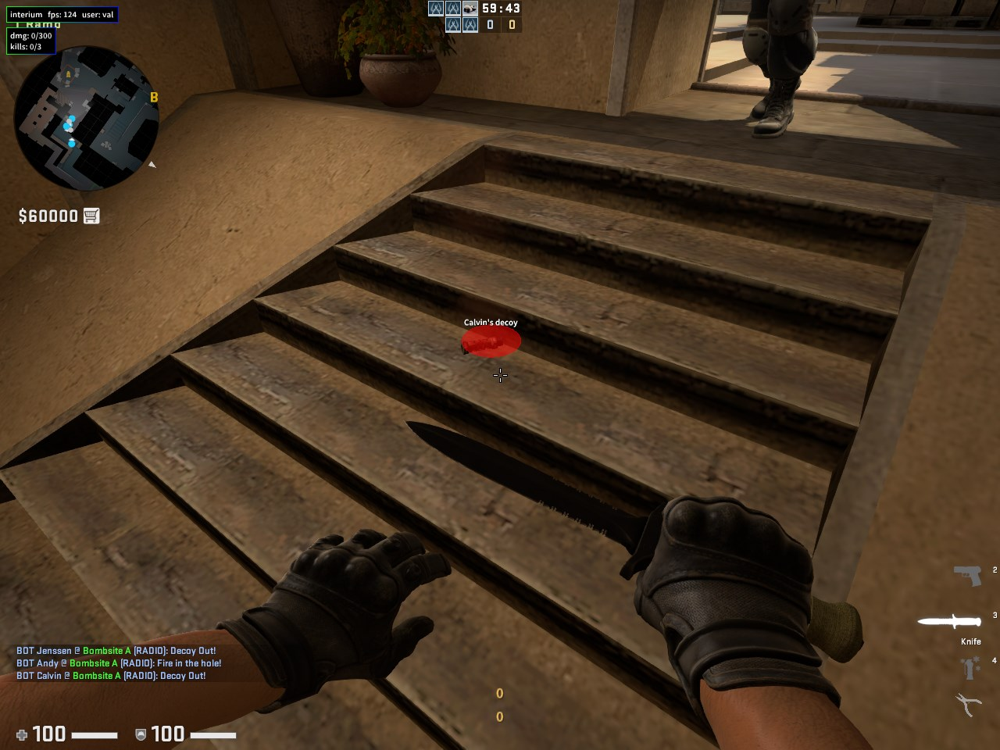
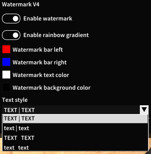
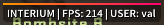
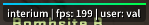
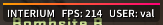
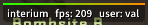

# interium_luas
 My luas that I made for interium

 ## crosshair.lua
 Allows more precise crosshair customization and circular dot.

 decoy_esp.lua 
 Made for griefing. Shows teammates' decoys and their name above it.

 Menu:

 

 Ingame:

 

 watermark_v4.lua
 My watermark lua made in the style of the original interium watermark. Allows for gradient customization and animated rainbow gradient. Has 4 different text types.

 Menu:

 

 Text style 1:

 

 Text style 2:

 

 Text style 3:

 

 Text style 4:

 
